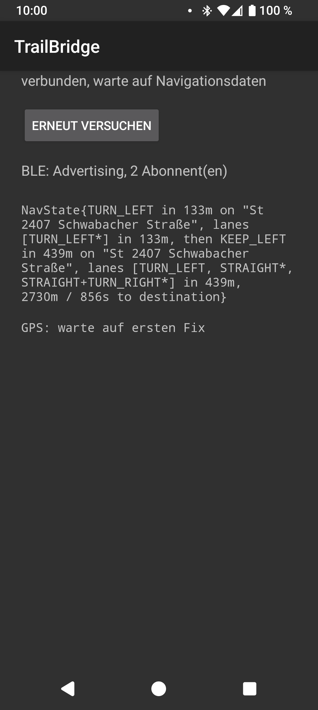
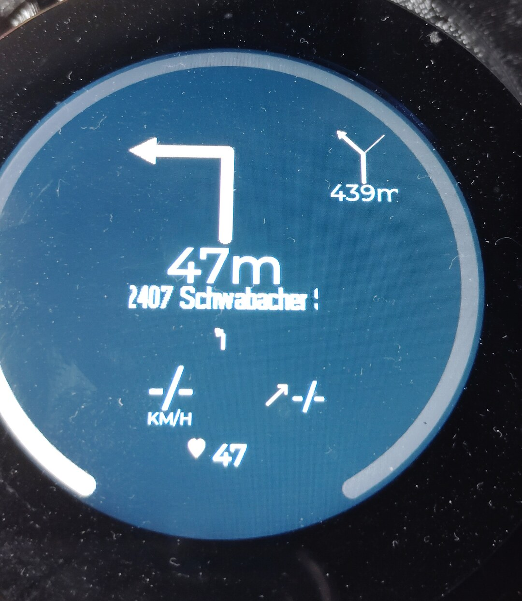

# TrailBridge

Android-Companion-App, die OsmAnds Turn-by-Turn-Navigation per BLE an den
[TRGB-BikeComputer](https://github.com/euphi/TRGB-BikeComputer) (ESP32)
weiterreicht -- als Ersatz für Komoots eingestellten BLE-Navigationsdienst.

## Was TrailBridge macht

- Liest OsmAnds Navigation per AIDL-API aus (Manöver, Straßennamen,
  übernächstes Manöver, Restdistanz/-zeit) und funkt sie als kompaktes
  TLV-Protokoll per BLE an den BikeComputer -- siehe [PROTOCOL.md](PROTOCOL.md).
- Zweiter, unabhängiger BLE-Service mit der rohen Handy-GPS-Position, direkt
  vom GPS-Chip -- funktioniert auch ohne laufendes OsmAnd.
- **Status:** Läuft Ende-zu-Ende. Die Firmware
  ([TRGB-BikeComputer](https://github.com/euphi/TRGB-BikeComputer)) spricht
  das Protokoll inklusive GPS-Position bereits. Erste Beta-APK: siehe
  [Releases](https://github.com/euphi/TrailBridge/releases).

  
  

## AIDL

Die OsmAnd-Anbindung nutzt OsmAnds offizielle
[AIDL-API](https://github.com/osmandapp/OsmAnd/tree/master/OsmAnd-api) --
die Schnittstellendateien dafür liegen 1:1 übernommen unter `app/src/main/aidl/`
und `app/src/main/java/net/osmand/aidlapi/`.

## Bauen

Siehe [BUILD.md](BUILD.md).

## Testen

1. OsmAnd installieren, Offline-Karte für deine Gegend laden.
2. TrailBridge installieren und öffnen -> Status zeigt
   "NICHT FREIGESCHALTET -- in OsmAnd: Menü > Plugins > ...".
3. In OsmAnd: Menü > Plugins > TrailBridge > aktivieren.
4. Zurück zu TrailBridge, "Erneut versuchen" antippen -> Status wird
   "verbunden, warte auf Navigationsdaten".
5. In OsmAnd eine Route starten (Ziel wählen, "Los") -> die Textausgabe
   sollte sich binnen ~1s füllen: Manöver, Distanz, Straßenname,
   übernächstes Manöver, Restdistanz/-zeit.
6. `adb logcat -s OsmAndLink -s BikeGatt` zeigt dieselben Infos als Log,
   falls die Bildschirmausgabe mal hakt.

Ohne BikeComputer lässt sich der BLE-Teil auch mit jeder BLE-Scanner-App
prüfen, z.B. [nRF Connect](https://www.nordicsemi.com/Products/Development-tools/nrf-connect-for-mobile)
-- UUIDs und Frame-Format siehe [PROTOCOL.md](PROTOCOL.md).
