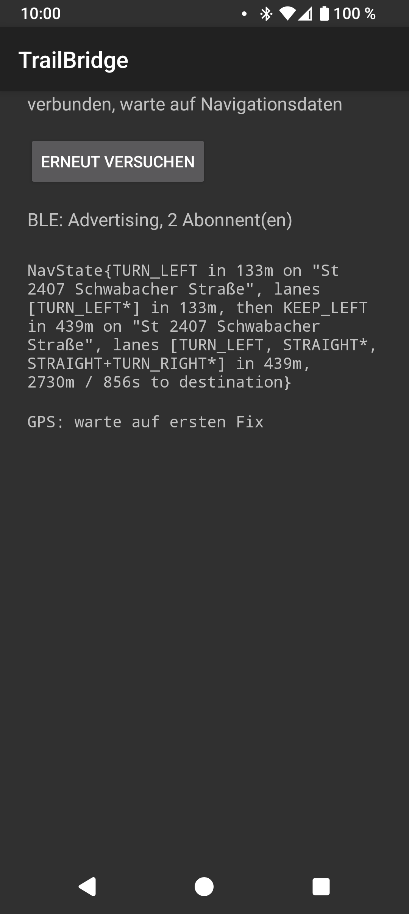
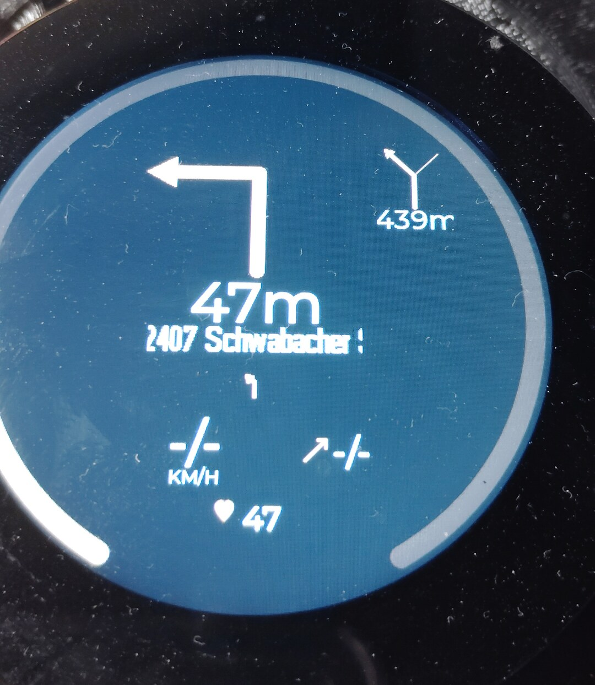

# TrailBridge

Android-Companion-App, die OsmAnds Turn-by-Turn-Navigation per BLE an den
[TRGB-BikeComputer](https://github.com/euphi/TRGB-BikeComputer) (ESP32)
weiterreicht -- als Ersatz für Komoots eingestellten BLE-Navigationsdienst.

## Was TrailBridge macht

- Liest OsmAnds Navigation per AIDL-API aus (Manöver, Straßennamen,
  übernächstes Manöver, Restdistanz/-zeit) und funkt sie als kompaktes
  TLV-Protokoll per BLE an den BikeComputer -- siehe [PROTOCOL.md](PROTOCOL.md).
- Zweiter, unabhängiger BLE-Service mit der rohen Handy-GPS-Position, direkt
  vom GPS-Chip -- funktioniert auch ohne laufendes OsmAnd.
- **GPX-Routen:** GPX-Datei öffnen/teilen/laden, "Route starten" -- TrailBridge
  navigiert dann selbst (GPS-Position auf die Route gematcht, kein OsmAnd
  nötig) und sendet dieselben Nav-Frames. Abbiegehinweise kommen aus der
  Datei (`rtept`, OsmAnd-Routensegmente), sonst aus der Track-Geometrie.
  Hat die Route Höhendaten, geht bei einer Steigung voraus ein Höhenprofil
  über einen eigenen BLE-Service raus (siehe PROTOCOL.md).
- **Testfahrt:** Die geladene GPX-Route lässt sich zum Testen "abspielen"
  (Button "Testfahrt"): TrailBridge schickt dem BikeComputer statt der echten
  GPS-Position eine Fake-Position entlang der Strecke -- mit passender
  Geschwindigkeit (aus den GPX-Zeitstempeln, sonst berechnet: langsamer
  bergauf, schneller bergab, vorsichtig in Kurven), Puls/Trittfrequenz/Leistung
  (aus der GPX, sonst auf Wunsch emuliert) und der Höhe der Route. Über ein Höhenprofil mit Manöver-Markern
  lässt sich beliebig vor- und zurückspulen. Details und Wire-Format:
  PROTOCOL.md, "Sensorwerte und Simulationsmodus".
- **Navi-Modus:** Button "Navi-Modus" im Hauptscreen -- ein reduzierter Screen
  für unterwegs: nur Navigation, Position und, solange eines an den BikeComputer
  gesendet ist, das Höhenprofil der Steigung voraus (mit Fahrerposition, wie
  die Firmware sie berechnet). Der Bildschirm bleibt dabei an; Route bzw. Testfahrt
  vorher im Hauptscreen starten. Siehe [DESIGN.md](DESIGN.md).
- **Status:** Läuft Ende-zu-Ende. Die Firmware
  ([TRGB-BikeComputer](https://github.com/euphi/TRGB-BikeComputer)) spricht
  das Protokoll inklusive GPS-Position bereits. Erste Beta-APK: siehe
  [Releases](https://github.com/euphi/TrailBridge/releases).

  
  

## AIDL

Die OsmAnd-Anbindung nutzt OsmAnds offizielle
[AIDL-API](https://github.com/osmandapp/OsmAnd/tree/master/OsmAnd-api) --
die Schnittstellendateien dafür liegen 1:1 übernommen unter `app/src/main/aidl/`
und `app/src/main/java/net/osmand/aidlapi/`.

## Unit-Tests

`gradle testDebugUnitTest` -- GPX-Parser, Abbiegeerkennung, Höhenprofil,
Route-Matching und Frame-Encoder sind reines Java ohne Android-Abhängigkeit.

## Bauen

Siehe [BUILD.md](BUILD.md), Veröffentlichung auf F-Droid: [FDROID.md](FDROID.md).

Design (Rim & Ridge, wie der BikeComputer): [DESIGN.md](DESIGN.md).

## Testen

1. OsmAnd installieren, Offline-Karte für deine Gegend laden.
2. TrailBridge installieren und öffnen -> Status zeigt
   "NICHT FREIGESCHALTET -- in OsmAnd: Menü > Plugins > ...".
3. In OsmAnd: Menü > Plugins > TrailBridge > aktivieren.
4. Zurück zu TrailBridge, "Erneut versuchen" antippen -> Status wird
   "verbunden, warte auf Navigationsdaten".
5. In OsmAnd eine Route starten (Ziel wählen, "Los") -> die Textausgabe
   sollte sich binnen ~1s füllen: Manöver, Distanz, Straßenname,
   übernächstes Manöver, Restdistanz/-zeit.
6. `adb logcat -s OsmAndLink -s BikeGatt` zeigt dieselben Infos als Log,
   falls die Bildschirmausgabe mal hakt.

### Testfahrt (GPX abspielen)

1. GPX laden, "Testfahrt" antippen -> Panel mit Höhenprofil.
2. Es zeigt, woher Geschwindigkeit, Puls und Trittfrequenz kommen (GPX oder
   nicht vorhanden); wo sie fehlen, lassen sie sich per Häkchen emulieren.
3. "Abspielen" startet die Fahrt am Anfang bzw. an der zuletzt gewählten Stelle
   (die Navigation startet dabei von selbst). Ins Höhenprofil tippen/ziehen
   spult an die Stelle, "« Manöver" / "Manöver »" springt 400 m vor das vorige/
   nächste Manöver. "Stopp" beendet die Testfahrt, der echte GPS-Fix gilt wieder.
4. Läuft in Echtzeit (1x). Der BikeComputer bekommt Position und Nav-Frames
   wie auf einer echten Fahrt; Die Sensorwerte (Geschwindigkeit, Puls,
   Trittfrequenz, Höhe, Leistung) wertet nur der Simulator-Build der Firmware (`trgb-esp32-s3-sim`)
   aus; sie sind im Protokoll als simuliert gekennzeichnet.

Ohne BikeComputer lässt sich der BLE-Teil auch mit jeder BLE-Scanner-App
prüfen, z.B. [nRF Connect](https://www.nordicsemi.com/Products/Development-tools/nrf-connect-for-mobile)
-- UUIDs und Frame-Format siehe [PROTOCOL.md](PROTOCOL.md).

## Lizenz

Copyright (C) 2026 Ian

TrailBridge steht unter der [GNU General Public License v3.0 oder später](LICENSE)
(GPL-3.0-or-later). Die übernommenen OsmAnd-AIDL-Dateien
(`net.osmand.aidlapi.*`) stammen aus dem GPLv3-lizenzierten
[OsmAnd-Repo](https://github.com/osmandapp/OsmAnd) (© OsmAnd BV).

Die gebündelten Schriften (Big Shoulders Display, IBM Plex Sans/Mono) stehen unter der
SIL Open Font License 1.1, nicht unter der GPL -- Herkunft und Lizenztexte in
[fonts/](fonts/README.md).
